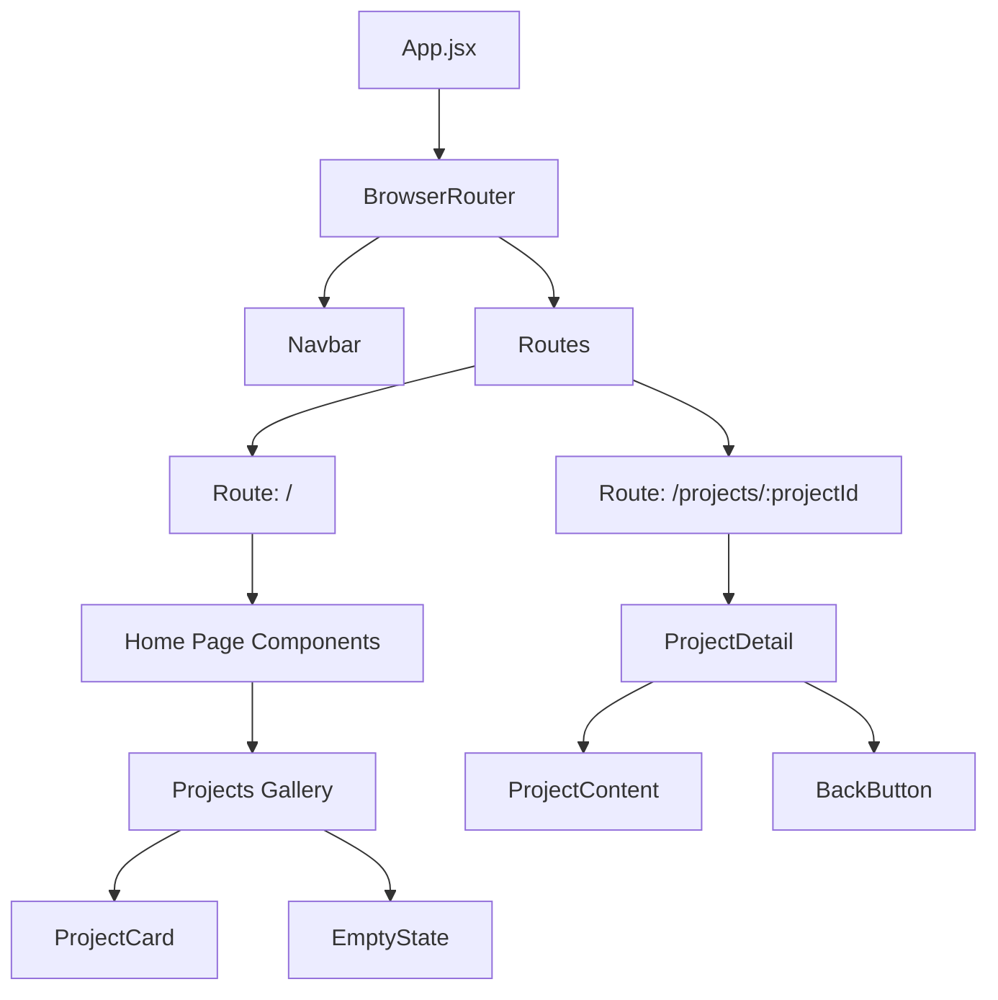

# Design Document: Project Gallery View

## Overview

This design enhances the portfolio website's Projects section by implementing individual project detail views, a comprehensive gallery navigation system, and an empty state handler for when no projects are available. The solution uses [React Router v6](https://reactrouter.com/) for client-side routing, enabling seamless navigation between the project gallery and individual project pages without full page reloads.

The architecture maintains the existing cyber-themed aesthetic while introducing new routing capabilities. The design follows React best practices for component composition, state management, and URL-based navigation patterns as described in the [React Router v6 documentation](https://reactrouter.com/en/main).

## Architecture

### High-Level Structure

```
App (BrowserRouter wrapper)
├── Navbar (persistent across routes)
├── Routes
│   ├── Route: "/" (Home page with all sections)
│   │   ├── Home
│   │   ├── About
│   │   ├── Skills
│   │   ├── Projects (Gallery view)
│   │   ├── Certificates
│   │   ├── Contact
│   │   └── Footer
│   └── Route: "/projects/:projectId" (Project detail view)
│       ├── ProjectDetail
│       └── Footer
└── Utility Components (MatrixRain, LocationConsent, etc.)
```

### Routing Strategy

The application will transition from a single-page scroll layout to a hybrid approach:
- **Main route (`/`)**: Displays the full portfolio with all sections including the project gallery
- **Project detail routes (`/projects/:projectId`)**: Displays individual project details with navigation back to gallery

This approach preserves the existing single-page experience while adding deep-linkable project pages. The `:projectId` parameter will use URL-safe slugs derived from project titles (e.g., "project-1", "my-awesome-app").

### Component Hierarchy



## Components and Interfaces

### 1. App Component (Modified)

**Purpose**: Wrap the application with routing capabilities and define route structure.

**Changes**:
- Import `BrowserRouter`, `Routes`, `Route` from `react-router-dom`
- Wrap existing content in `BrowserRouter`
- Define routes for home page and project details
- Extract current single-page layout into a dedicated route

**Interface**:
```javascript
// No props - root component
function App() {
  // Returns BrowserRouter with Routes configuration
}
```

### 2. Projects Component (Modified to ProjectsGallery)

**Purpose**: Display all projects in a grid layout or show empty state when no projects exist.

**Responsibilities**:
- Load project data from centralized source
- Detect empty project list and render EmptyState component
- Render project cards with click handlers for navigation
- Maintain existing animations and styling

**Interface**:
```javascript
function ProjectsGallery() {
  // Props: none (reads from data source)
  // Returns: Grid of ProjectCard components or EmptyState
}
```

**Key Logic**:
```javascript
const projects = getProjects() // Load from data source

if (projects.length === 0) {
  return <EmptyState />
}

return (
  <div className="project-grid">
    {projects.map(project => (
      <ProjectCard key={project.id} project={project} />
    ))}
  </div>
)
```

### 3. ProjectCard Component (New)

**Purpose**: Display a single project preview with navigation to detail view.

**Responsibilities**:
- Render project thumbnail, title, brief description, and skills
- Handle click events to navigate to project detail
- Apply hover effects and animations
- Handle image loading errors with fallbacks

**Interface**:
```javascript
function ProjectCard({ project }) {
  // Props:
  //   project: {
  //     id: string,
  //     title: string,
  //     description: string,
  //     image: string,
  //     link: string,
  //     skills: string[]
  //   }
  // Returns: Clickable card element
}
```

**Navigation Logic**:
```javascript
import { useNavigate } from 'react-router-dom'

const navigate = useNavigate()

const handleClick = () => {
  navigate(`/projects/${project.id}`)
}
```

### 4. ProjectDetail Component (New)

**Purpose**: Display comprehensive information about a single project.

**Responsibilities**:
- Extract project ID from URL using `useParams`
- Load project data based on ID
- Display full project information with enhanced layout
- Provide navigation back to gallery
- Handle non-existent project IDs (404 case)

**Interface**:
```javascript
function ProjectDetail() {
  // Props: none (reads from URL params)
  // Returns: Detailed project view or error state
}
```

**Key Logic**:
```javascript
import { useParams, useNavigate } from 'react-router-dom'

const { projectId } = useParams()
const navigate = useNavigate()
const project = getProjectById(projectId)

if (!project) {
  // Redirect to gallery or show 404
  return <ProjectNotFound />
}

return (
  <div className="project-detail">
    <BackButton onClick={() => navigate('/#projects')} />
    <ProjectContent project={project} />
  </div>
)
```

### 5. EmptyState Component (New)

**Purpose**: Display "Coming Soon" message with image when no projects exist.

**Responsibilities**:
- Render placeholder image
- Display coming soon message
- Match cyber-themed aesthetic
- Provide visual feedback that content is intentional

**Interface**:
```javascript
function EmptyState() {
  // Props: none
  // Returns: Coming soon display with image
}
```

**Visual Structure**:
```javascript
return (
  <div className="empty-state">
    
    <h3>Projects Coming Soon</h3>
    <p>Check back later for exciting projects!</p>
  </div>
)
```

### 6. Project Data Module (New)

**Purpose**: Centralize project data management and provide utility functions.

**Responsibilities**:
- Store project data in structured format
- Provide functions to retrieve all projects
- Provide functions to retrieve project by ID
- Generate URL-safe project IDs from titles

**Interface**:
```javascript
// src/data/projects.js

export const projects = [
  {
    id: 'project-1',
    title: 'Project 1',
    description: 'Full project description...',
    image: '/projects/project1.jpg',
    link: 'https://example.com',
    skills: ['React', 'Node.js', 'MongoDB'],
    longDescription: 'Extended description for detail view...',
    features: ['Feature 1', 'Feature 2'],
    technologies: ['Tech 1', 'Tech 2']
  },
  // ... more projects
]

export function getProjects() {
  return projects
}

export function getProjectById(id) {
  return projects.find(project => project.id === id)
}

export function generateProjectId(title) {
  return title.toLowerCase().replace(/\s+/g, '-').replace(/[^a-z0-9-]/g, '')
}
```

## Data Models

### Project Model

```javascript
{
  id: string,              // URL-safe unique identifier (e.g., "my-project")
  title: string,           // Display title (e.g., "My Project")
  description: string,     // Brief description for gallery view (1-2 sentences)
  longDescription: string, // Extended description for detail view (optional)
  image: string,           // Path to project image (e.g., "/projects/project1.jpg")
  link: string,            // External project URL
  skills: string[],        // Array of skill/technology tags
  features: string[],      // Array of key features (optional, for detail view)
  technologies: string[]   // Array of technologies used (optional, for detail view)
}
```

### Route Parameters

```javascript
{
  projectId: string  // Extracted from URL path "/projects/:projectId"
}
```

## Correctness Properties

*A property is a characteristic or behavior that should hold true across all valid executions of a system—essentially, a formal statement about what the system should do. Properties serve as the bridge between human-readable specifications and machine-verifiable correctness guarantees.*


### Property 1: Project Card Navigation

*For any* project in the gallery, clicking on its card should trigger navigation to that project's detail view with the correct project ID.

**Validates: Requirements 1.1**

### Property 2: Project Detail Completeness

*For any* valid project object, rendering the project detail view should display all required fields: title, description, image, external link, and skills list.

**Validates: Requirements 1.2**

### Property 3: URL Synchronization

*For any* project navigation action, the browser URL should update to reflect the current project identifier in the format `/projects/:projectId`.

**Validates: Requirements 1.4, 4.1**

### Property 4: Deep Linking Round Trip

*For any* valid project, constructing a URL with its project ID and loading that URL directly should render the correct project detail view.

**Validates: Requirements 1.5, 4.3**

### Property 5: Gallery Completeness

*For any* non-empty array of projects, the gallery view should render a card for each project in the data source.

**Validates: Requirements 2.1, 2.4**

### Property 6: Project Card Field Completeness

*For any* project rendered in the gallery, its card should display the project's title, brief description, thumbnail image, and skills list.

**Validates: Requirements 2.2**

### Property 7: Data Reactivity - Addition

*For any* project added to the data source, the gallery view should automatically include that project in the rendered output.

**Validates: Requirements 3.4, 6.2**

### Property 8: Browser History Navigation

*For any* sequence of navigation actions between gallery and detail views, using browser back/forward buttons should correctly navigate through the history stack.

**Validates: Requirements 4.2**

### Property 9: Invalid Project Handling

*For any* non-existent or invalid project ID in the URL, the application should either redirect to the gallery view or display an appropriate error message without crashing.

**Validates: Requirements 4.4**

### Property 10: Image Fallback Handling

*For any* project with an image that fails to load, the detail view should display a fallback image or placeholder without breaking the layout.

**Validates: Requirements 5.4**

### Property 11: Data Reactivity - Removal

*For any* project removed from the data source, the gallery view should automatically exclude that project from the rendered output.

**Validates: Requirements 6.3**

### Property 12: Project Data Structure Validation

*For any* project object in the data source, it should contain all required fields: id, title, description, image, link, and skills array.

**Validates: Requirements 6.4**

## Error Handling

### Navigation Errors

**Invalid Project IDs**:
- When a user navigates to `/projects/:projectId` with a non-existent ID
- The `ProjectDetail` component should check if the project exists
- If not found, redirect to the home page with hash navigation to projects section (`/#projects`)
- Alternative: Display a `ProjectNotFound` component with a link back to gallery

**Implementation**:
```javascript
function ProjectDetail() {
  const { projectId } = useParams()
  const navigate = useNavigate()
  const project = getProjectById(projectId)
  
  useEffect(() => {
    if (!project) {
      navigate('/#projects', { replace: true })
    }
  }, [project, navigate])
  
  if (!project) {
    return null // or <ProjectNotFound />
  }
  
  return <ProjectContent project={project} />
}
```

### Image Loading Errors

**Failed Image Loads**:
- Use `onError` handler on `` elements
- Fallback to placeholder image with project title
- Maintain consistent aspect ratio and styling

**Implementation**:
```javascript
 {
    e.target.src = `https://via.placeholder.com/800x600/0a0a0a/00FF88?text=${encodeURIComponent(project.title)}`
  }}
/>
```

### Empty State Handling

**No Projects Available**:
- Check if projects array length is zero
- Render `EmptyState` component instead of empty grid
- Prevent navigation to project details when no projects exist

**Implementation**:
```javascript
function ProjectsGallery() {
  const projects = getProjects()
  
  if (projects.length === 0) {
    return <EmptyState />
  }
  
  return <ProjectGrid projects={projects} />
}
```

### Route Not Found

**Unmatched Routes**:
- Add a catch-all route at the end of Routes configuration
- Redirect to home page or display 404 page
- Preserve existing functionality for hash-based navigation

**Implementation**:
```javascript
<Routes>
  <Route path="/" element={<HomePage />} />
  <Route path="/projects/:projectId" element={<ProjectDetail />} />
  <Route path="*" element={<Navigate to="/" replace />} />
</Routes>
```

## Testing Strategy

This feature will use a dual testing approach combining unit tests for specific scenarios and property-based tests for universal behaviors.

### Unit Testing

Unit tests will focus on:
- **Specific examples**: Empty state rendering, back button presence, specific project rendering
- **Edge cases**: Empty project arrays, missing project fields, malformed project IDs
- **Error conditions**: Image load failures, invalid navigation attempts, missing data
- **Integration points**: Router integration, component mounting, navigation events

**Example Unit Tests**:
```javascript
describe('EmptyState', () => {
  it('should display coming soon message when no projects exist', () => {
    render(<ProjectsGallery projects={[]} />)
    expect(screen.getByText(/coming soon/i)).toBeInTheDocument()
  })
})

describe('ProjectDetail', () => {
  it('should display back button', () => {
    render(<ProjectDetail />)
    expect(screen.getByRole('button', { name: /back/i })).toBeInTheDocument()
  })
})
```

### Property-Based Testing

Property-based tests will verify universal properties across many generated inputs using a PBT library like [fast-check](https://fast-check.dev/) for JavaScript/TypeScript.

**Configuration**:
- Minimum 100 iterations per property test
- Each test tagged with feature name and property number
- Tag format: `Feature: project-gallery-view, Property {N}: {property text}`

**Example Property Tests**:
```javascript
import fc from 'fast-check'

// Feature: project-gallery-view, Property 5: Gallery Completeness
describe('Property 5: Gallery Completeness', () => {
  it('should render a card for each project in non-empty array', () => {
    fc.assert(
      fc.property(
        fc.array(projectArbitrary, { minLength: 1 }),
        (projects) => {
          const { container } = render(<ProjectsGallery projects={projects} />)
          const cards = container.querySelectorAll('.project-card')
          expect(cards.length).toBe(projects.length)
        }
      ),
      { numRuns: 100 }
    )
  })
})

// Feature: project-gallery-view, Property 12: Project Data Structure Validation
describe('Property 12: Data Structure Validation', () => {
  it('should have all required fields for any project', () => {
    fc.assert(
      fc.property(
        projectArbitrary,
        (project) => {
          expect(project).toHaveProperty('id')
          expect(project).toHaveProperty('title')
          expect(project).toHaveProperty('description')
          expect(project).toHaveProperty('image')
          expect(project).toHaveProperty('link')
          expect(project).toHaveProperty('skills')
          expect(Array.isArray(project.skills)).toBe(true)
        }
      ),
      { numRuns: 100 }
    )
  })
})
```

**Arbitrary Generators**:
```javascript
const projectArbitrary = fc.record({
  id: fc.stringOf(fc.constantFrom(...'abcdefghijklmnopqrstuvwxyz0123456789-'), { minLength: 3, maxLength: 20 }),
  title: fc.string({ minLength: 1, maxLength: 50 }),
  description: fc.string({ minLength: 10, maxLength: 200 }),
  image: fc.webUrl(),
  link: fc.webUrl(),
  skills: fc.array(fc.string({ minLength: 1, maxLength: 20 }), { minLength: 1, maxLength: 10 })
})
```

### Testing Balance

- **Unit tests**: Focus on specific examples (empty state, back button, error messages) and integration points
- **Property tests**: Verify universal behaviors (all projects render, data structure validity, navigation consistency)
- Together, these approaches provide comprehensive coverage without excessive redundancy

### Test Organization

```
src/
├── components/
│   ├── __tests__/
│   │   ├── ProjectsGallery.test.jsx (unit tests)
│   │   ├── ProjectsGallery.properties.test.jsx (property tests)
│   │   ├── ProjectDetail.test.jsx (unit tests)
│   │   ├── ProjectDetail.properties.test.jsx (property tests)
│   │   ├── ProjectCard.test.jsx (unit tests)
│   │   └── EmptyState.test.jsx (unit tests)
│   ├── ProjectsGallery.jsx
│   ├── ProjectDetail.jsx
│   ├── ProjectCard.jsx
│   └── EmptyState.jsx
└── data/
    ├── __tests__/
    │   └── projects.test.js (unit tests for data utilities)
    └── projects.js
```

## Implementation Notes

### React Router v6 Installation

```bash
npm install react-router-dom
```

### Hash Navigation Compatibility

The existing portfolio uses hash-based navigation for smooth scrolling (e.g., `/#projects`). The new routing system must maintain compatibility:

```javascript
// In Navbar component
<a href="/#projects">Projects</a>

// In ProjectDetail back button
<button onClick={() => navigate('/#projects')}>Back to Gallery</button>
```

### Scroll Behavior

When navigating back to the gallery from a project detail:
- Use hash navigation to scroll to projects section
- Preserve scroll position when using browser back button
- Consider using `scrollRestoration` configuration

```javascript
// In BrowserRouter setup
<BrowserRouter>
  <ScrollRestoration />
  {/* routes */}
</BrowserRouter>
```

### Performance Considerations

- **Code splitting**: Consider lazy loading ProjectDetail component
- **Image optimization**: Use appropriate image sizes and formats
- **Animation performance**: Use CSS transforms for smooth animations
- **Data caching**: Projects data is static, no need for complex state management

### Accessibility

- Ensure all interactive elements are keyboard accessible
- Provide appropriate ARIA labels for navigation controls
- Maintain focus management when navigating between views
- Ensure sufficient color contrast for cyber-themed elements

### Migration Path

1. Install React Router v6
2. Create new components (ProjectCard, ProjectDetail, EmptyState)
3. Extract project data to separate module
4. Modify App.jsx to add routing
5. Refactor existing Projects component to ProjectsGallery
6. Test navigation flows
7. Add empty state handling
8. Implement error boundaries for robustness
